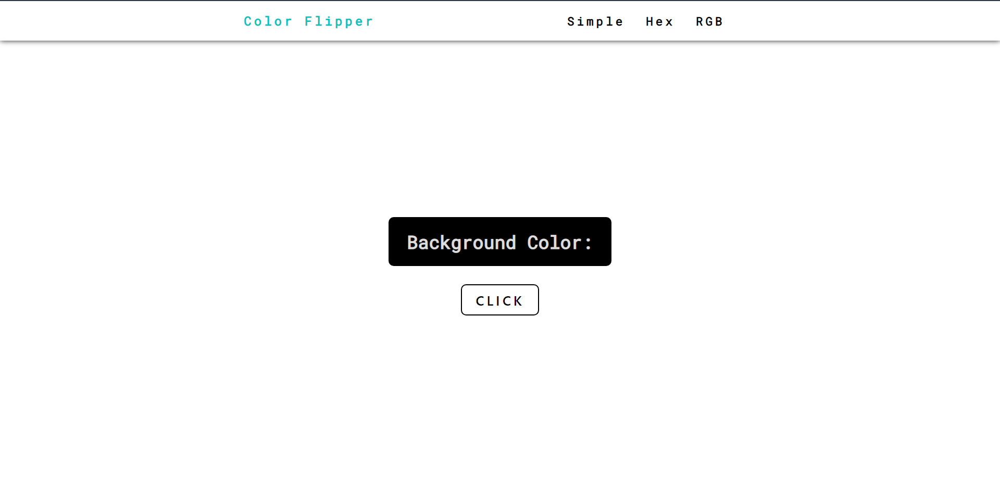

# Color Flipper JS
 
Um gerador de cores, hexadecimais e RGB, que muda o background do site, de acordo com a cor gerada após clicar no botão.

<h4>:heavy_check_mark: Projeto Concluído</h4>

<h4>
 :link: 
 <a href="color-flipper-alpha.vercel.app">Acesse aqui</a>
</h4>

### 🛠 Tecnologias

Essas são as ferramentas usadas no projeto:

- HTML
- CSS 3
- JavaScript

### :mailbox: Autor

Feito por Vitor Guedes :heart:

